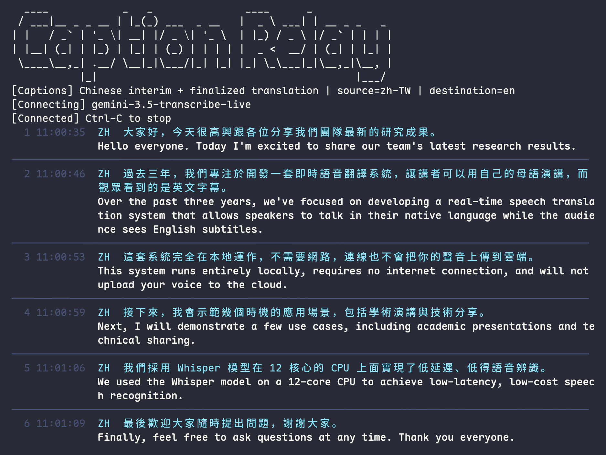
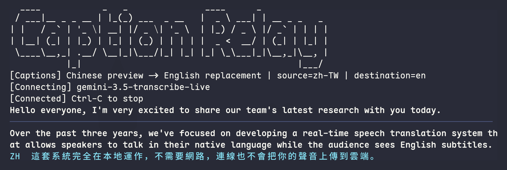

# Caption Relay

Terminal-first live speech captioning and translation.

Caption Relay streams microphone audio to a transcription backend, turns finalized source-language utterances into destination-language captions, and renders them in a split terminal such as Kitty. The default backend is Gemini Live; local Whisper and sherpa-onnx routes remain available for comparison and offline work.

Caption Relay is the public project name and the checkout directory is `caption-relay`.

## Screenshots

Traditional Chinese (Taiwan) speech captioned into English. Both captures are unedited Gemini output in Kitty for the synthetic sample audio (see [Sample audio source](#sample-audio-source)), so they include real recognition mistakes (for example 時機 for 實際).

Bilingual history with caption numbers and receive times. Set `show_zh = true` under `[display]` in `captions.toml` (it has no CLI flag), then run:

```bash
./start.sh --source-language zh-TW --line-numbers --timestamps --file fixtures/test_zh_paused16k.wav
```



Default replacement mode: the newest Traditional Chinese line stays as a preview until its English translation replaces it.

```bash
./start.sh --source-language zh-TW --file fixtures/test_zh_paused16k.wav
```



## Features

- Gemini Live low-latency transcription with interim and finalized text.
- Configurable source language (`auto` by default) and destination language (`en` by default).
- Chinese preview that is replaced by the finalized translation when `show_zh = false`.
- Normal-size terminal captions by default; optional Kitty text scaling remains supported.
- English captions without an artificial `EN` prefix.
- Optional caption-number and receive-time column that stays correct when translations finish out of order.
- Low-contrast separators between completed captions; wrapped lines do not receive extra separators.
- PortAudio input selection by device-name fragment, with PipeWire as the default.
- English runtime logs and configuration errors for public-project usability.
- Optional local Whisper, sherpa-onnx, and WhisperLive comparison routes.

## Quick start

Requirements:

- Linux/macOS with Python 3.12.
- [`uv`](https://docs.astral.sh/uv/).
- PortAudio development packages for microphone use. On Arch Linux:

  ```bash
  sudo pacman -S --needed portaudio base-devel
  ```

Install and run:

```bash
uv sync --locked
export GEMINI_API_KEY="your-api-key"
./start.sh
```

Run the deterministic fixture instead of a microphone:

```bash
./start.sh --file fixtures/test_zh_paused16k.wav
```

The fixture must be 16 kHz, mono, 16-bit PCM WAV.

### Sample audio source

The sample audio is synthetic speech, not a recording of a person.

- **Text:** `fixtures/test_zh.txt`, a six-sentence Traditional Chinese presentation script in this repository.
- **Voice:** [Piper](https://github.com/rhasspy/piper) TTS with `zh_CN-huayan-medium` from [rhasspy/piper-voices](https://huggingface.co/rhasspy/piper-voices/tree/main/zh/zh_CN/huayan/medium). According to its model card, the voice was trained on the [HuaYan_TTS](https://github.com/PlayVoice/HuaYan_TTS) dataset (finetuned from Piper's English `lessac` voice), and its license is listed as **Unknown**. It is a Mainland Mandarin voice reading Traditional Chinese text.
- **Files** (local only, ignored by git and not redistributed with this project):

  | File | Format | Length | Content |
  |---|---|---|---|
  | `fixtures/test_zh_paused.wav` | 22.05 kHz mono 16-bit | 38.7 s | One sentence per synthesis, joined with 0.6 s of silence by `scripts/make_paused.py` |
  | `fixtures/test_zh_paused16k.wav` | 16 kHz mono 16-bit | 38.7 s | 16 kHz copy used by Caption Relay and the screenshots |
  | `fixtures/test_zh.wav`, `fixtures/test_zh16k.wav` | 22.05 kHz / 16 kHz | 36.1 s | The same script without inserted pauses; used by some `routes/` probes. No generator is committed for it |

To regenerate the paused fixture, download the Piper voice into `models/`, run `uv sync --extra fixtures`, then `uv run python scripts/make_paused.py`, and resample it, for example with `ffmpeg -i fixtures/test_zh_paused.wav -ar 16000 -ac 1 fixtures/test_zh_paused16k.wav`. Because the voice license is unknown, do not commit or publish the generated audio; the README screenshots show only the terminal text.

`start.sh` resolves the Python project from its own location, so it can be launched from another working directory. It runs the `caption-relay` console script, which is equivalent to `uv run caption-relay` or `uv run python -m caption_relay` inside the checkout.

Audio-device and WAV-format errors are reported before the Gemini session opens.

## Configuration

`captions.toml` is the user-facing configuration file. It is read relative to the project directory by default.

```toml
[display]
zh_scale = 1.0
en_scale = 1.0
show_zh = false
line_numbers = false
timestamps = false

[languages]
source = "auto"
destination = "en"

[audio]
input_device = "pipewire"
```

### Language

- `languages.source`: `auto` or a BCP-47 code such as `zh-TW`. With the sample audio, `auto` produced Simplified Chinese transcripts and `zh-TW` produced Traditional Chinese; set `zh-TW` if you want Traditional Chinese previews.
- `languages.destination`: a language code or name used in the translation request; default `en`.
- One-run overrides: `--source-language`, `--destination-language`.

Gemini Live does not provide speaker diarization or word-level timestamps in its live streaming route. Those features require a non-streaming transcription workflow. Caption Relay's optional timestamps are application receive times (see Display).

### Display

- `zh_scale` and `en_scale`: `0.5`, `1.0`, `1.2`, or `1.5`. `1.0` is recommended for dense terminal layouts.
- `show_zh = false`: show Chinese interim/final text temporarily, then replace that utterance with the translation. If translation fails, the source preview and an English error remain visible.
- Kitty 0.40+ supports the text sizing protocol used by scaled captions. Scaled text occupies terminal grid rows; `1.0` avoids the extra row required by enlarged text.
- In interactive terminals, completed captions are separated by a subtle gray rule. Redirected output omits terminal decoration.
- `line_numbers = true` adds a left column with the caption number; `timestamps = true` adds the local time (`HH:MM:SS`) at which the finalized source text arrived. Numbers follow finalization order, so they stay with their caption when translations complete out of order. Wrapped rows are indented under the text rather than numbered again. Redirected output keeps the column as plain text. One-run overrides: `--line-numbers`/`--no-line-numbers`, `--timestamps`/`--no-timestamps`.
- Scaled captions (`1.2`, `1.5`) wrap at character boundaries, not word boundaries.

### Audio

`audio.input_device` is matched case-insensitively against PortAudio input-device names. Use a fragment such as `pipewire`, `ALC257 Analog`, or `Stereo Microphone`.

The launcher suppresses harmless ALSA diagnostics emitted while PortAudio probes unavailable profiles. A real device-selection or stream-opening failure is not suppressed.

### Environment variables

| Variable | Default | Purpose |
|---|---|---|
| `GEMINI_API_KEY` | — | Gemini API key; required for the Gemini route |
| `GEMINI_LIVE_MODEL` | `gemini-3.5-transcribe-live` | Live transcription model |
| `GEMINI_XLATE_MODEL` | `gemini-flash-lite-latest` | Finalized-utterance translation model |
| `WL_VOCAB` | empty | Comma-separated recognition terms |

Runtime status, configuration errors, audio errors, and translation errors are emitted in English. Audio and finalized text are sent to Gemini in the Gemini route; do not describe this route as offline.

## Project layout

```text
caption-relay/
├── src/caption_relay/      # Primary Gemini route (installable package)
│   ├── cli.py              # Entry point: credentials, audio source, session lifetime
│   ├── config.py           # captions.toml + CLI overrides -> validated Config
│   ├── audio.py            # Microphone, WAV fixture, audio events (chunk, pause, end)
│   ├── events.py           # Caption events shared by providers, coordinator, renderers
│   ├── coordinator.py      # Caption IDs, receive times, translation task lifetime
│   ├── translation.py      # Translator protocol and TranslationRequest
│   ├── providers/
│   │   ├── gemini_live.py  # Gemini Live transcription -> events
│   │   └── gemini_text.py  # Gemini per-utterance translation
│   └── renderers/
│       └── terminal.py     # Terminal/Kitty rendering only
├── tests/                  # Unit tests and Kitty parser-backed display tests
├── routes/                 # Optional comparison routes (separate from the package)
│   ├── README.md           # Route index: commands, extras, privacy
│   ├── offline/            # VAD + faster-whisper
│   ├── sherpa/             # sherpa-onnx streaming recognition and probes
│   └── whisperlive/        # WhisperLive server, clients, and launchers
├── scripts/                # Fixture generation
├── fixtures/               # Transcript (audio files are local-only)
├── models/                 # Local model files (not committed)
├── docs/                   # Design documents
├── captions.toml           # User-facing configuration
└── start.sh                # Stable launcher
```

## Architecture

```text
Microphone | WavFile
  -> audio_events(): AudioChunk, UtteranceEnd, StreamEnd
  -> GeminiLiveTranscriber            emits SessionStatus, InterimText, FinalTranscript
  -> CaptionCoordinator               FinalTranscript -> FinalText(id, text, received_at)
       -> Translator (GeminiTranslator) per FinalText, bounded concurrency
       <- TranslationReady(id) | TranslationFailed(id)
  -> CaptionDisplay.handle(event)     preview replacement, separators, metadata column
  -> Kitty/TTY output
```

`cli.py` wires these together after `config.parse_args()` and opens the audio source before connecting.

Important boundaries:

- `config.py` is the only CLI/configuration boundary; nothing else reads TOML.
- `audio.py` owns PortAudio, ALSA diagnostics, WAV validation, and pause detection. It does not know about Gemini.
- `providers/` owns network sessions and provider response models; nothing outside it imports the Google SDK except `cli.py`, which creates the client.
- `coordinator.py` owns caption IDs and translation task lifetime. It depends only on the `Translator` protocol, so tests use a fake translator.
- `renderers/terminal.py` consumes events only. It must not call providers or read API keys.
- `captions.toml` owns user-selectable language, audio, and display defaults.
- `tests/test_terminal_renderer.py` exercises terminal transitions through Kitty's parser with synthetic events, not source-string snapshots.

Comparison routes live in `routes/`; see [`routes/README.md`](routes/README.md) for commands, dependency extras, and what each route sends off the machine.

## Development setup

```bash
uv sync --locked
uv run python -m unittest discover -s tests -v
uv run python -m compileall -q src tests routes scripts
./start.sh --help
```

For optional backends:

```bash
uv sync --locked --extra offline
uv sync --locked --extra sherpa
uv sync --locked --extra whisperlive
```

Do not commit API keys, recordings, model files, virtual environments, generated output, or machine-specific configuration. `.gitignore` already excludes the current local-only artifacts; review it before publishing a new fixture.

## Verification status

The primary Gemini route has been exercised with the 38.7-second synthetic sample audio and produced six finalized English captions. The microphone path has been opened successfully through the configured PipeWire device. The test suite has 59 tests. Configuration parsing, WAV validation, microphone selection (with a fake PyAudio), audio events, the caption coordinator (with a fake translator: ID stability, out-of-order completion, failures, bounded concurrency, cancellation), and the Gemini translator request shape have unit tests. The terminal renderer has 30 Kitty-backed regression tests covering replacement ordering, separators (including bilingual grouping), wrapping, narrow splits, mixed-width text, redirected output, failure retention, and the metadata column. The metadata column has also been inspected in a real Kitty window with the sample audio.

The following are not promises: microphone quality in every environment, exact semantic translation quality, speaker identity, word-level timing, or offline privacy for the Gemini route.

## Refactoring roadmap

See [`docs/REFACTORING.md`](docs/REFACTORING.md) for staged changes. Stages 1–5 are implemented; the roadmap records what remains and what is deliberately out of scope.

## AI-assisted maintenance

See [`AGENTS.md`](AGENTS.md). It is the source of truth for agent setup, architecture boundaries, verification commands, and change discipline.

## Security and privacy

Never commit `api.key`, `GEMINI_API_KEY`, `.env` files, audio recordings, or model artifacts. Gemini Live uploads audio and text to Google's service. This repository is licensed under the MIT License; add a contribution and security contact before public release if the hosting platform does not provide one.
